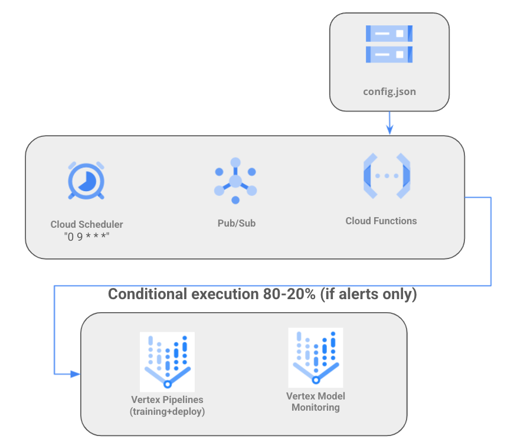

# Vertex AI LABS for Finance

This repository contains code samples for Vertex AI, including pipelines, metadata and more. Mainly with finance datasets.  
Setup and authentication instructions of Vertex SDK are available [here](https://cloud.google.com/vertex-ai/docs/start/client-libraries). Please, complete those before trying any of the labs below.

Sample codes include pipelines, custom training and others. There are three ways to build components in a pipeline:

1. **Docker containers as Components**: most complex. You must write a component `yaml`, that tells the runner how to execute your docker container. You can find a sample in **Lab 1**.

2. **Python scripts as Components**: you must write a Python script and package it in a container.  Then write a component yaml, which tells the system how to execute your component. You can find a sample in **Lab 2**.

3. **Python functions as Component**: easiest way. Use the `@dsl.component` in KFP v2 to package a python function as a component. You can find some samples in **Labs 3 and 4**.


## Lab 1: two-step pipeline with custom containers

This pipeline uses a public dataset at 
[gs://financial_fraud_detection/fraud_data_kaggle.csv](gs://financial_fraud_detection/fraud_data_kaggle.csv) to run a two-step pipeline using custom containers. The Dockerfile definition of each container as well as the code is separated in each directory.

Output of pipeline with custom containers:


## Lab 2: three-step pipeline with GCP operators

This pipeline uses the same public dataset as Lab 1 (tabular detaset, fraud detection) with AutoML, using GCP operators. The three-step pipeline include loading data, training and prediction.

Output of pipeline with GCP components:


## Lab 3: three-step pipeline with lightweight Python components and TensorFlow

Demo code of a production pipeline using Vertex Pipelines, and training a model using lightweight python components:

* **Preprocess component:** Load from BigQuery using tensorflow_io
* **Train component:** custom train using a Keras model with 4 layers. 
* **Upload and deploy component:** upload and deploy into an endpoint in Vertex.

To install the proper libraries:

```bash
gsutil cp gs://cloud-aiplatform-pipelines/releases/latest/kfp-1.5.0rc5.tar.gz .
gsutil cp gs://cloud-aiplatform-pipelines/releases/latest/aiplatform_pipelines_client-0.1.0.caip20210415-py3-none-any.whl 

python3 -m pip install google-cloud-aiplatform
python3 -m pip install kfp-1.5.0rc5.tar.gz --upgrade
python3 -m pip install aiplatform_pipelines_client-0.1.0.caip20210415-py3-none-any.whl  --upgrade
```


## Lab 4: two-step pipeline with lightweight Python components and XGB

Demo code of a production pipeline with the following services:

* **[Vertex Pipelines](https://cloud.google.com/vertex-ai/docs/pipelines/introduction)**
* **[Vertex ML Metadata](https://cloud.google.com/vertex-ai/docs/ml-metadata/introduction)**


## Lab 5: Simple TFX pipeline with Vertex training and prediction components

Creates a three component penguin pipeline with TFX. You need these frameworks and in these versions:
```
TensorFlow version: 2.6.0
TFX version: 1.3.0
KFP version: 1.8.2
```


## Lab 6: Cloud Pub/Sub to trigger a pipeline based on Vertex monitoring alerts

Lab 6 uses Cloud Scheduler and Pub/Sub to trigger a Cloud Function, which retrains a pipeline. The pipeline is called only if there are **active alerts** in the Vertex Model Monitoring service.

Setup: 
1. First, you need to train a model for the first time (churn model) running the `retraining.py` pipeline. Note `endpoint` parameter empty. The same retraining pipeline will be launched later from the Cloud Function.
2. Second, you need to create and trigger a monitor alert with `monitor-create.py` and `monitor-trigger.py` (modify the `ENDPOINT_ID` with the model trained from the pipeline). Note that today **Model Monitoring** is only capable to send email notification alerts when any skews are detected. If you want to automatize this, please note also that usually those skews or drifts requires human interaction for troubleshooting or decision making on the retraining. For example, a skew could be caused by a security attack.
3. Finally, create the automatization: create a Cloud Scheduler and a Cloud Function triggered by Pub/Sub. The code for the function is in the `main.py` code provided. Modify the `ENDPOINT` and `MONITORING_JOB` parameters in `config.json`. The cloud function will retrain the pipeline using the pipeline definition file (`retraining-demo-uscentral1.json`) with a new model in 80/20 split configuration **only if there are alerts in the endpoint**.

The retraining process from the cloud function is governed by a config file `config.json` that contains some parameters for the pipeline as well as a boolean variable (default is `true`) to decide if the pipeline will be executed or not, independently of the alert.
As stated before, two files must be uploaded to GCS for the retraining:
1. `retraining-demo-uscentral1.json`: pipeline definition file.
2. `config.json`: configuration file for the Cloud Function. This config file allows to make relevant changes on key parameters without modifying the Cloud Function or the pipeline code.

Cloud Scheduler is configured with frequency `0 9 * * *` (see other sample schedules [here](https://cloud.google.com/scheduler/docs/configuring/cron-job-schedules#sample_schedules)), i.e. one execution every day at 9am that will run the Cloud Function.



FAQ:
* In case you get this error when creating the **Model monitoring job**, add the `bigquery insert` permission to the service account.
```
Error message:
Permission denied for account service-XXXXXXX@gcp-sa-aiplatform.iam.gserviceaccount.com to Insert BigQuery Job.
```
* To get the list of monitoring jobs and their ids:
```sh
gcloud beta ai model-monitoring-jobs list --project=<YOUR_PROJECT_ID>
#######
analysisInstanceSchemaUri: gs://cloud-ai-platform-abc42042-bdf5-4c28-864c-213c408e7d49/instance_schemas/job-245487961133547520/analysis
bigqueryTables:
- bigqueryTablePath: bq://windy-site-254307.model_deployment_monitoring_7369586636331417600.serving_predict
  logSource: SERVING
  logType: PREDICT
createTime: '2021-10-22T13:47:27.752348Z'
displayName: churn
endpoint: projects/655797269815/locations/us-central1/endpoints/7369586636331417600
logTtl: 0s
loggingSamplingStrategy:
  randomSampleConfig:
    sampleRate: 0.8
modelDeploymentMonitoringObjectiveConfigs:
- deployedModelId: '2508443419794210816'
  objectiveConfig:
    predictionDriftDetectionConfig:
      driftThresholds:
        cnt_user_engagement:
          value: 0.5
        country:
          value: 0.001
        language:
          value: 0.001
    trainingDataset:
      bigquerySource:
        inputUri: bq://mco-mm.bqmlga4.train
      targetField: churned
    trainingPredictionSkewDetectionConfig:
      skewThresholds:
        cnt_user_engagement:
          value: 0.5
        country:
          value: 0.001
        language:
          value: 0.001
modelDeploymentMonitoringScheduleConfig:
  monitorInterval: 3600s
modelMonitoringAlertConfig:
  emailAlertConfig:
    userEmails:
    - rafaelsanchez@google.com
name: projects/655797269815/locations/us-central1/modelDeploymentMonitoringJobs/245487961133547520
nextScheduleTime: '2021-10-25T10:00:00Z'
predictInstanceSchemaUri: gs://cloud-ai-platform-abc42042-bdf5-4c28-864c-213c408e7d49/instance_schemas/job-245487961133547520/predict
scheduleState: OFFLINE
state: JOB_STATE_RUNNING
statsAnomaliesBaseDirectory:
  outputUriPrefix: gs://cloud-ai-platform-abc42042-bdf5-4c28-864c-213c408e7d49/model_monitoring/job-245487961133547520
updateTime: '2021-10-25T09:15:55.176995Z'
```

## Lab 7: Feature Store

Create a Managed Vertex Feature Store, importing data and perform online and batch serving.

## Labs 10-11-12: Vertex custom training job (ULB dataset) with pre-built containers

These labs create and deploy ML models for the ULB dataset. In all cases it uses a managed Tensorboard
* Lab 10: with CPUs. 
* Lab 11: with GPUs.
* Lab 12: with GPUs and Hypterparameter tuning.

Setup for labs 10-11-12:
1. Copy the public table `bigquery-public-data.ml_datasets_ulb` into your project and region. Easiest way for this table size is to download as CSV and then upload it into BigQuery with schema autodetect.
2. Create a tensorboard instance with `gcloud ai tensorboards create --display-name DISPLAY_NAME --project PROJECT_NAME`, and modify the `TENSORBOARD_RESOURCE` env variable accordingly.
3. Create a service account for the Tensorboard service. It must have the Storage Admin role (`roles/storage.admin`) and Vertex AI User role (`roles/aiplatform.user`) associated with it.

Notes:
* TensorFlow and Tensorflow I/O versions must be compatible. Check [here](https://github.com/tensorflow/io#tensorflow-version-compatibility)


## Lab 13: Vertex custom training job (Iris dataset) with custom containers

Simple Vertex custom training job, using TensorFlow pre-built custom containers (for training and serving) and the [tabular iris dataset](https://archive.ics.uci.edu/ml/datasets/iris).

For more information about custom training in Vertex, visit the [official documentation](https://cloud.google.com/vertex-ai/docs/training/custom-training) and [this github repo](https://github.com/rafaelsf80/vertex-custom-training)


## Lab 14: experiments

Vertex AI provides two tools for ecxperiment tracking: Vertex experiments and Managed Tensorboard.
This lab shows how to track training hyperparameters with Vertex experiments.


## Lab 13: simple prediction

Simple prediction on the model deployed in Lab 3 (fraud detection dataset)


## References

[1] Notebook samples about Vertex AI (part 1): https://github.com/GoogleCloudPlatform/vertex-ai-samples/tree/master/notebooks  
[2] Notebooks samples about Vertex AI (part 2): https://github.com/GoogleCloudPlatform/cloudml-samples/tree/master/notebooks  
[3] Codelab Intro to Vertex Pipelines: https://codelabs.developers.google.com/vertex-pipelines-intro  
[4] Codelab Vertex pipelines and metadata: https://codelabs.developers.google.com/vertex-mlmd-pipelines  
[5] Practitioners guide to MLOps: https://cloud.google.com/resources/mlops-whitepaper  
[6] Feature attributions in model monitoring: https://cloud.google.com/blog/topics/developers-practitioners/monitoring-feature-attributions-how-google-saved-one-largest-ml-services-trouble