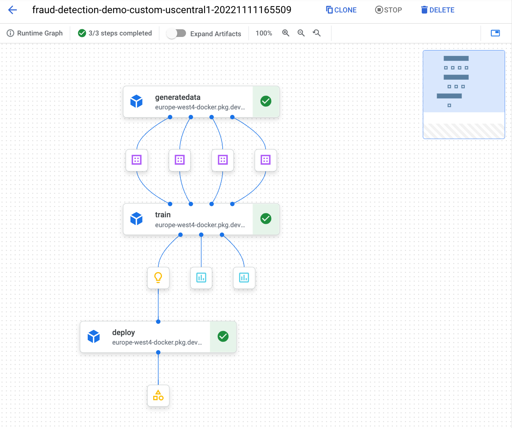
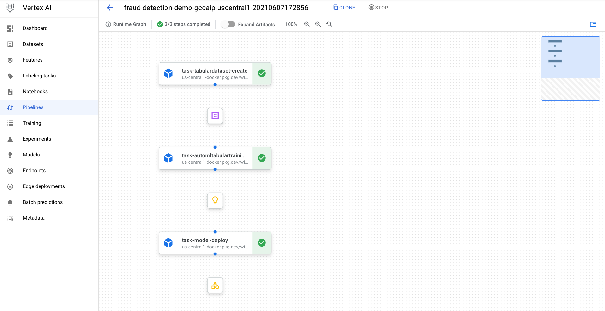
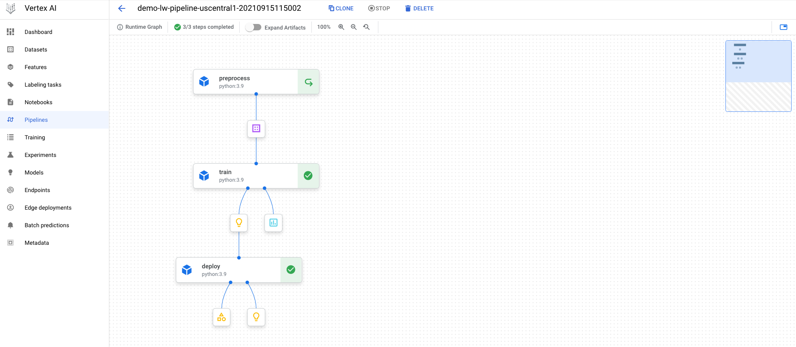
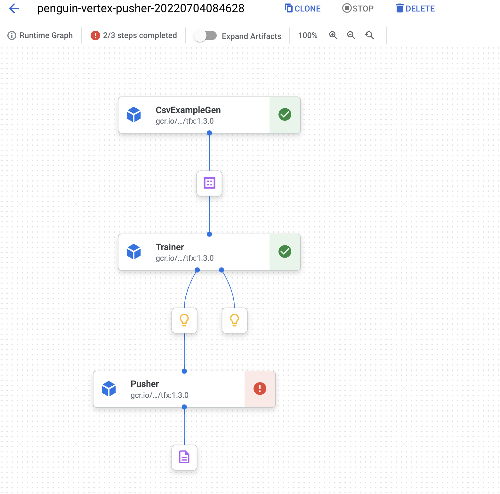

# Vertex AI LABS

This repository contains code samples for **Vertex AI**, including pipelines, metadata and more. Mainly with **finance datasets**.  
Setup and authentication instructions of Vertex SDK are available [here](https://cloud.google.com/vertex-ai/docs/start/client-libraries). Please, complete those before trying any of the labs below.

Sample codes include pipelines, custom training and others. There are three ways to build components in a pipeline:

1. **Docker containers as Components**: most complex. You must write a component `yaml`, that tells the runner how to execute your docker container. You can find a sample in **Lab 1**.

2. **Python scripts as Components**: you must write a Python script and package it in a container.  Then write a component yaml, which tells the system how to execute your component. You can find a sample in **Lab 2**.

3. **Python functions as Component**: easiest way. Use the `@dsl.component` decorator in KFP v2 to package a python function as a component. You can find some samples in **Labs 3 and 4**.


## Lab 01: two-step pipeline with custom containers

This pipeline uses a public dataset at 
[gs://financial_fraud_detection/fraud_data_kaggle.csv](gs://financial_fraud_detection/fraud_data_kaggle.csv) to run a two-step pipeline using custom containers. The Dockerfile definition of each container as well as the code is separated in each directory.

Output of pipeline with custom containers:



## Lab 02: three-step pipeline with GCP operators

This pipeline uses the ULB dataset (tabular detaset, fraud detection) with AutoML, using GCP operators. The three-step pipeline include loading data, training and prediction.

Output of pipeline with GCP components:



## Lab 03: three-step pipeline with lightweight Python components and TensorFlow

Using the ULB dataset, this pipeline trains a Keras model using lightweight python components:

* **Preprocess component:** Load from BigQuery using tensorflow_io
* **Train component:** custom train using a Keras model with 4 layers. 
* **Upload and deploy component:** upload and deploy into an endpoint in Vertex.

To install the proper libraries:



Q: NotImplementedError: unable to open file: libtensorflow_io.so, from paths: ['/usr/local/lib/python3.8/site-packages/tensorflow_io/python/ops/libtensorflow_io.so']
A: TensorFlow and Tensorflow I/O versions must be compatible. Check version compatibility [here](https://github.com/tensorflow/io#tensorflow-version-compatibility) and change the base image and packages accordingly:
```py
@component(
    base_image="gcr.io/deeplearning-platform-release/tf2-cpu.2-6:latest",
    packages_to_install=['tensorflow_io==0.21.0']
)
```


## Lab 04: two-step pipeline with lightweight Python components and XGB

Using two datasets (beans) of different sizes, this code runs two pipelines and makes a pipeline comparison using Vertex AI:

* **[Vertex Pipelines](https://cloud.google.com/vertex-ai/docs/pipelines/introduction)**
* **[Vertex ML Metadata](https://cloud.google.com/vertex-ai/docs/ml-metadata/introduction)**


## Lab 05: Simple TFX pipeline with Vertex training and prediction components

As dataset, we will use same Palmer Penguins dataset. There are four numeric features in this dataset which were already normalized to have range [0,1]. We will build a classification model which predicts the species of penguins. Most code of this example is taken from https://www.tensorflow.org/tfx/tutorials/tfx/penguin_simple.


Setup. You need to upload these two files to GCS:
1. Dataset at `gs://download.tensorflow.org/data/palmer_penguins/penguins_processed.csv` to `DATA_ROOT` folder. You need to make our own copy of the dataset, because TFX ExampleGen reads inputs from a directory.
2. Trainer file `penguin_trainer.py` to `MODULE_ROOT` folder.

Creates a three component penguin pipeline with TFX. You need these frameworks and in these versions:
```
TensorFlow version: 2.6.0
TFX version: 1.3.0
KFP version: 1.8.2
```

Q: Error when calling `from tfx import v1 as tfx`: `AttributeError: module 'tensorflow.tools.docs.doc_controls' has no attribute 'inheritable_header'`   
A: Downgrading `tensorflow-estimators` and `keras` to 2.6 resolved the issue:
```
pip3 install -U tensorflow-estimators==2.6.0
pip3 install -U keras==2.6.0
```




## Lab 06: Cloud Pub/Sub to trigger a pipeline based on Vertex monitoring alerts

Lab 6 uses Cloud Scheduler and Pub/Sub to trigger a Cloud Function, which retrains a pipeline. The pipeline is called only if there are **active alerts** in the Vertex Model Monitoring service.

Setup: 
1. First, you need to train a model for the first time (churn model) running the `retraining.py` pipeline. Note `endpoint` parameter empty. The same retraining pipeline will be launched later from the Cloud Function.
2. Second, you need to create and trigger a monitor alert with `monitor-create.py` and `monitor-trigger.py` (modify the `ENDPOINT_ID` with the model trained from the pipeline). Note that today **Model Monitoring** is only capable to send email notification alerts when any skews are detected. If you want to automatize this, please note also that usually those skews or drifts requires human interaction for troubleshooting or decision making on the retraining. For example, a skew could be caused by a security attack.
3. Finally, create the automatization: create a Cloud Scheduler and a Cloud Function triggered by Pub/Sub. The code for the function is in the `main.py` code provided. Modify the `ENDPOINT` and `MONITORING_JOB` parameters in `config.json`. The cloud function will retrain the pipeline using the pipeline definition file (`retraining-demo-uscentral1.json`) with a new model in 80/20 split configuration **only if there are alerts in the endpoint**.

The retraining process from the cloud function is governed by a config file `config.json` that contains some parameters for the pipeline as well as a boolean variable (default is `true`) to decide if the pipeline will be executed or not, independently of the alert.
As stated before, two files must be uploaded to GCS for the retraining:
1. `retraining-demo-uscentral1.json`: pipeline definition file.
2. `config.json`: configuration file for the Cloud Function. This config file allows to make relevant changes on key parameters without modifying the Cloud Function or the pipeline code.

Cloud Scheduler is configured with frequency `0 9 * * *` (see other sample schedules [here](https://cloud.google.com/scheduler/docs/configuring/cron-job-schedules#sample_schedules)), i.e. one execution every day at 9am that will run the Cloud Function.


FAQ:
* In case you get this error when creating the **Model monitoring job**, add the `bigquery insert` permission to the service account.
```
Error message:
Permission denied for account service-XXXXXXX@gcp-sa-aiplatform.iam.gserviceaccount.com to Insert BigQuery Job.
```
* To get the list of monitoring jobs and their ids:
```sh
gcloud beta ai model-monitoring-jobs list --project=<YOUR_PROJECT_ID>
#######
analysisInstanceSchemaUri: gs://cloud-ai-platform-abc42042-bdf5-4c28-864c-213c408e7d49/instance_schemas/job-245487961133547520/analysis
bigqueryTables:
- bigqueryTablePath: bq://windy-site-254307.model_deployment_monitoring_7369586636331417600.serving_predict
  logSource: SERVING
  logType: PREDICT
createTime: '2021-10-22T13:47:27.752348Z'
displayName: churn
endpoint: projects/655797269815/locations/us-central1/endpoints/7369586636331417600
logTtl: 0s
loggingSamplingStrategy:
  randomSampleConfig:
    sampleRate: 0.8
modelDeploymentMonitoringObjectiveConfigs:
- deployedModelId: '2508443419794210816'
  objectiveConfig:
    predictionDriftDetectionConfig:
      driftThresholds:
        cnt_user_engagement:
          value: 0.5
        country:
          value: 0.001
        language:
          value: 0.001
    trainingDataset:
      bigquerySource:
        inputUri: bq://mco-mm.bqmlga4.train
      targetField: churned
    trainingPredictionSkewDetectionConfig:
      skewThresholds:
        cnt_user_engagement:
          value: 0.5
        country:
          value: 0.001
        language:
          value: 0.001
modelDeploymentMonitoringScheduleConfig:
  monitorInterval: 3600s
modelMonitoringAlertConfig:
  emailAlertConfig:
    userEmails:
    - rafaelsanchez@google.com
name: projects/655797269815/locations/us-central1/modelDeploymentMonitoringJobs/245487961133547520
nextScheduleTime: '2021-10-25T10:00:00Z'
predictInstanceSchemaUri: gs://cloud-ai-platform-abc42042-bdf5-4c28-864c-213c408e7d49/instance_schemas/job-245487961133547520/predict
scheduleState: OFFLINE
state: JOB_STATE_RUNNING
statsAnomaliesBaseDirectory:
  outputUriPrefix: gs://cloud-ai-platform-abc42042-bdf5-4c28-864c-213c408e7d49/model_monitoring/job-245487961133547520
updateTime: '2021-10-25T09:15:55.176995Z'
```


## Lab 07: Feature Store

Creates a **Managed Vertex AI Feature Store**, importing data and perform online and batch serving. The following scripts are provided:

* `fs_create_and_import_fraud.py`: create a Feature Store and perform a batch ingestion of 5000 samples from the [Kaggle fraud detection dataset](gs://financial_fraud_detection/fraud_data_kaggle.csv), stored in GCS.
* `fs_create_and_import_gapic.py`: same as previous one, but using gapic library and enabling monitoring.
* `fs_create_and_import_ulb.py`: creates a Feature Store and perform a batch ingestion of the ULB dataset stored in BigQuery.
* `fs_delete.py`: removes an existing Feature Store.
* `fs_online_serving.py`: performs online serving over an existing Feature Store.
* `fs_batch_serving.py`: performs batch serving over an existing Feature Store.

You must upload the following data to GCS and BigQuery:
* `fraud_data_kaggle_5000.csv`: required for the scripts working with the Kaggle fraud detection dataset (`fs_create_and_import_fraud.py` and `fs_create_and_import_gapic.py`).
* `read_entity_instance.csv`: required for batch serving (script `fs_batch_serving.py`).
* A copy of the ULB dataset must also be stored in BigQuery to run the script `fs_create_and_import_ulb.py` (refer to constant `BQ_SOURCE`).


## Labs 10-11-12: Vertex custom training (ULB dataset) with pre-built containers

These labs create and deploy ML models for the ULB dataset. In all cases it uses a managed Tensorboard to track some metrics:
* **Lab 10:** with CPU. 
* **Lab 11:** with GPU.
* **Lab 12:** with GPU and Hyperparameter tuning.

Setup:
1. Copy the public table `bigquery-public-data.ml_datasets.ulb` into your project and region. Easiest way for this table size is to export as CSV to GCS and then upload it into BigQuery with schema autodetect. Multiregional tables in BigQuery or GCS works with regional training in Vertex AI training. For example: you can run a Vertex AI training job in `europe-west4` using a EU multiregional dataset from a BigQuery.
2. Create a tensorboard instance with `gcloud ai tensorboards create --display-name DISPLAY_NAME --project PROJECT_NAME`, and modify the `TENSORBOARD_RESOURCE` env variable accordingly. Example:
```sh
gcloud beta ai tensorboards create --display-name ml-in-the-cloud-rafaelsanchez --project argolis-rafaelsanchez-ml-dev
Created Vertex AI Tensorboard: projects/989788194604/locations/europe-west4/tensorboards/3449511023961178112
```
3. Create a service account for the Tensorboard service. It must have the Storage Admin role (`roles/storage.admin`) and Vertex AI User role (`roles/aiplatform.user`) associated with it. Additionally the BQ Read session role (`bigquery.readsessions.create`) and BigQuery Data Editor (`bigquery.tables.get`) is required for this specific example.

Run:
```sh
python3 10-training-tables-ulb/custom_training_simple.py
python3 11-training-tables-ulb-gpu/custom_training_simple_gpu.py
python3 12-training-tables-ulb-ht/custom_training_simple_ht.py
```

Notes:
* TensorFlow and Tensorflow I/O versions must be compatible in your environment. This is guaranteed if you use Vertex AI Workbench. Check version compatibility [here](https://github.com/tensorflow/io#tensorflow-version-compatibility).


## Lab 13: Vertex custom training (Iris dataset) with custom containers

Simple Vertex custom training job, using TensorFlow **custom containers** (for training) and the [tabular iris dataset](https://archive.ics.uci.edu/ml/datasets/iris). This lab uses GPUs.

Setup:
1. Copy the public table `bigquery-public-data.ml_datasets.iris` into your project and region. Easiest way for this table size is to export as CSV to GCS and then upload it into BigQuery with schema autodetect.
2. Create the repository and submit the custom container to **Artifact Registry**:
```sh
gcloud artifacts repositories create ml-pipelines-repo --repository-format=docker --location=europe-west4 --description="ML pipelines repository"
gcloud auth configure-docker europe-west4-docker.pkg.dev
gcloud builds submit --tag europe-west4-docker.pkg.dev/argolis-rafaelsanchez-ml-dev/ml-pipelines-repo/vertex-iris-demo
```

Instructions:
```sh
python3 13-training-tables-iris/mbsdk_all.py
```

For more information about custom training in Vertex, visit the [official documentation](https://cloud.google.com/vertex-ai/docs/training/custom-training) and [this github repo](https://github.com/rafaelsf80/vertex-custom-training)


## Lab 14: experiments

Vertex AI provides two tools for experiment tracking with Vertex experiments and Managed Tensorboard.
This lab shows how to track training hyperparameters with Vertex experiments.


## Lab 20: simple prediction

Simple prediction on the model deployed in Lab 3 and 10-11-12 (fraud detection model). For both online and batch, make sure you modify the `endpoint_id` and `model_id` in the source code accordingly.

* **Online predict:** Input format (note can actually be multiple):
```python
response = endpoint.predict([{'Time': 80422,'Amount': 17.99,'V1': -0.24,'V2': -0.027,'V3': 0.064,'V4': -0.16,'V5': -0.152,'V6': -0.3,'V7': -0.03,'V8': -0.01,'V9': -0.13,'V10': -0.13 ,'V11': -0.16,'V12': 0.06,'V13': -0.11,'V14': 2.1,'V15': -0.07,'V16': -0.033,'V17': -0.14,'V18': -0.08,'V19': -0.062,'V20': -0.08,'V21': -0.06,'V22': -0.088,'V23': -0.03,'V24': -0,15, 'V25': -0.04,'V26': -0.99,'V27': -0.13,'V28': 0.003}])
Prediction(predictions=[[1.88683789e-05]], deployed_model_id='7739198465124597760', explanations=None)
```

* **Batch predict:** Input format, with multiple inputs as shown by `saved_model_cli`, content of file [batch_ulb_gcs_5.jsonl](batch_ulb_gcs_5.jsonl):
```json
{"Time": 80422, "Amount": 17.99, "V1": -0.24, "V2": -0.027, "V3": 0.064, "V4": -0.16, "V5": -0.152, "V6": -0.3, "V7": -0.03, "V8": -0.01, "V9": -0.13, "V10": -0.18, "V11": -0.16, "V12": 0.06, "V13": -0.11, "V14": 2.1, "V15": -0.07, "V16": -0.033, "V17": -0.14, "V18": -0.08, "V19": -0.062, "V20": -0.08, "V21": -0.06, "V22": -0.088, "V23": -0.03, "V24": 0.01, "V25": -0.04, "V26": -0.99, "V27": -0.13, "V28": 0.003}
{"Time": 80522, "Amount": 18.99, "V1": -0.24, "V2": -0.027, "V3": 0.064, "V4": -0.16, "V5": -0.152, "V6": -0.3, "V7": -0.03, "V8": -0.01, "V9": -0.13, "V10": -0.18, "V11": -0.16, "V12": 0.06, "V13": -0.11, "V14": 2.1, "V15": -0.07, "V16": -0.033, "V17": -0.14, "V18": -0.08, "V19": -0.062, "V20": -0.08, "V21": -0.06, "V22": -0.088, "V23": -0.03, "V24": 0.01, "V25": -0.04, "V26": -0.99, "V27": -0.13, "V28": 0.003}
{"Time": 80622, "Amount": 19.99, "V1": -0.24, "V2": -0.027, "V3": 0.064, "V4": -0.16, "V5": -0.152, "V6": -0.3, "V7": -0.03, "V8": -0.01, "V9": -0.13, "V10": -0.18, "V11": -0.16, "V12": 0.06, "V13": -0.11, "V14": 2.1, "V15": -0.07, "V16": -0.033, "V17": -0.14, "V18": -0.08, "V19": -0.062, "V20": -0.08, "V21": -0.06, "V22": -0.088, "V23": -0.03, "V24": 0.01, "V25": -0.04, "V26": -0.99, "V27": -0.13, "V28": 0.003}
```

Output of batch prediction:
```json
```

This is `saved_model_cli` output:
```sh
saved_model_cli show --dir rafa --tag_set serve --signature_def serving_default

The given SavedModel SignatureDef contains the following input(s):
  inputs['Amount'] tensor_info:
      dtype: DT_FLOAT
      shape: (-1, 1)
      name: serving_default_Amount:0
  inputs['Time'] tensor_info:
      dtype: DT_FLOAT
      shape: (-1, 1)
      name: serving_default_Time:0
  inputs['V1'] tensor_info:
      dtype: DT_FLOAT
      shape: (-1, 1)
      name: serving_default_V1:0
  inputs['V10'] tensor_info:
      dtype: DT_FLOAT
      shape: (-1, 1)
      name: serving_default_V10:0
  inputs['V11'] tensor_info:
      dtype: DT_FLOAT
      shape: (-1, 1)
      name: serving_default_V11:0
  inputs['V12'] tensor_info:
      dtype: DT_FLOAT
      shape: (-1, 1)
      name: serving_default_V12:0
  inputs['V13'] tensor_info:
      dtype: DT_FLOAT
      shape: (-1, 1)
      name: serving_default_V13:0
  inputs['V14'] tensor_info:
      dtype: DT_FLOAT
      shape: (-1, 1)
      name: serving_default_V14:0
  inputs['V15'] tensor_info:
      dtype: DT_FLOAT
      shape: (-1, 1)
      name: serving_default_V15:0
  inputs['V16'] tensor_info:
      dtype: DT_FLOAT
      shape: (-1, 1)
      name: serving_default_V16:0
  inputs['V17'] tensor_info:
      dtype: DT_FLOAT
      shape: (-1, 1)
      name: serving_default_V17:0
  inputs['V18'] tensor_info:
      dtype: DT_FLOAT
      shape: (-1, 1)
      name: serving_default_V18:0
  inputs['V19'] tensor_info:
      dtype: DT_FLOAT
      shape: (-1, 1)
      name: serving_default_V19:0
  inputs['V2'] tensor_info:
      dtype: DT_FLOAT
      shape: (-1, 1)
      name: serving_default_V2:0
  inputs['V20'] tensor_info:
      dtype: DT_FLOAT
      shape: (-1, 1)
      name: serving_default_V20:0
  inputs['V21'] tensor_info:
      dtype: DT_FLOAT
      shape: (-1, 1)
      name: serving_default_V21:0
  inputs['V22'] tensor_info:
      dtype: DT_FLOAT
      shape: (-1, 1)
      name: serving_default_V22:0
  inputs['V23'] tensor_info:
      dtype: DT_FLOAT
      shape: (-1, 1)
      name: serving_default_V23:0
  inputs['V24'] tensor_info:
      dtype: DT_FLOAT
      shape: (-1, 1)
      name: serving_default_V24:0
  inputs['V25'] tensor_info:
      dtype: DT_FLOAT
      shape: (-1, 1)
      name: serving_default_V25:0
  inputs['V26'] tensor_info:
      dtype: DT_FLOAT
      shape: (-1, 1)
      name: serving_default_V26:0
  inputs['V27'] tensor_info:
      dtype: DT_FLOAT
      shape: (-1, 1)
      name: serving_default_V27:0
  inputs['V28'] tensor_info:
      dtype: DT_FLOAT
      shape: (-1, 1)
      name: serving_default_V28:0
  inputs['V3'] tensor_info:
      dtype: DT_FLOAT
      shape: (-1, 1)
      name: serving_default_V3:0
  inputs['V4'] tensor_info:
      dtype: DT_FLOAT
      shape: (-1, 1)
      name: serving_default_V4:0
  inputs['V5'] tensor_info:
      dtype: DT_FLOAT
      shape: (-1, 1)
      name: serving_default_V5:0
  inputs['V6'] tensor_info:
      dtype: DT_FLOAT
      shape: (-1, 1)
      name: serving_default_V6:0
  inputs['V7'] tensor_info:
      dtype: DT_FLOAT
      shape: (-1, 1)
      name: serving_default_V7:0
  inputs['V8'] tensor_info:
      dtype: DT_FLOAT
      shape: (-1, 1)
      name: serving_default_V8:0
  inputs['V9'] tensor_info:
      dtype: DT_FLOAT
      shape: (-1, 1)
      name: serving_default_V9:0
The given SavedModel SignatureDef contains the following output(s):
  outputs['dense_1'] tensor_info:
      dtype: DT_FLOAT
      shape: (-1, 1)
      name: StatefulPartitionedCall:0
Method name is: tensorflow/serving/predict
```

## References

`[1]` Notebook samples about Vertex AI (part 1): https://github.com/GoogleCloudPlatform/vertex-ai-samples/tree/master/notebooks  
`[2]` Notebooks samples about Vertex AI (part 2): https://github.com/GoogleCloudPlatform/cloudml-samples/tree/master/notebooks  
`[3]` Codelab Intro to Vertex Pipelines: https://codelabs.developers.google.com/vertex-pipelines-intro  
`[4]` Codelab Vertex pipelines and metadata: https://codelabs.developers.google.com/vertex-mlmd-pipelines  
`[5]` Practitioners guide to MLOps: https://cloud.google.com/resources/mlops-whitepaper  
`[6]` Feature attributions in model monitoring: https://cloud.google.com/blog/topics/developers-practitioners/monitoring-feature-attributions-how-google-saved-one-largest-ml-services-trouble   