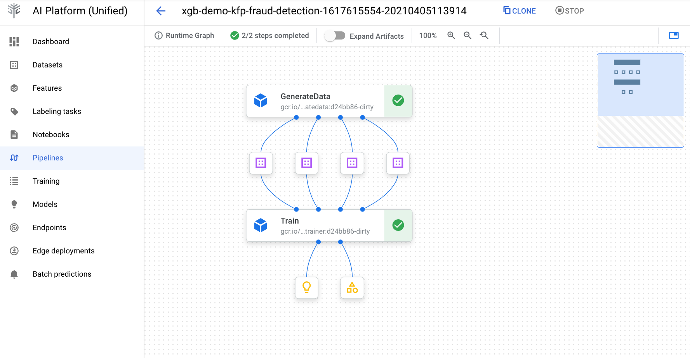
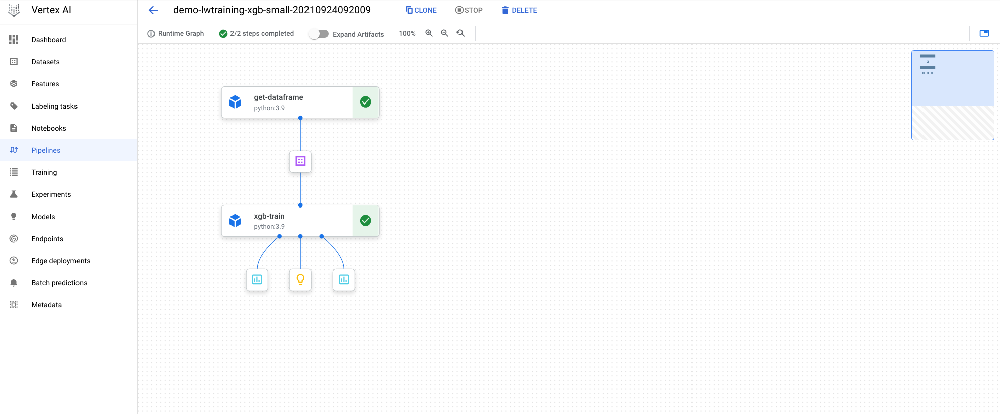

# Vertex AI LABS

This repository contains sample codes for Vertex AI, including pipelines, metadata and more.  
Setup and authentication instructions of Vertex SDK are available [here](https://cloud.google.com/vertex-ai/docs/start/client-libraries). Please, complete those before trying any of the labs below.

Sample codes include pipelines, custom training and others. There are three ways to build components in a pipeline:

1. **Docker containers as Components**: most complex. You must write a component `yaml`, that tells the runner how to execute your docker container. You can find a sample in **Lab 1**.

2. **Python scripts as Components**: you must write a Python script and package it in a container.  Then write a component yaml, which tells the system how to execute your component. You can find a sample in **Lab 2**.

3. **Python functions as Component**: easiest way. Use the `@dsl.component` in KFP v2 to package a python function as a component. You can find some samples in **Labs 3 and 4**.


## Lab 1: two-step pipeline with custom containers

This pipeline uses a public dataset at 
[gs://financial_fraud_detection/fraud_data_kaggle.csv](gs://financial_fraud_detection/fraud_data_kaggle.csv) to run a two-step pipeline using custom containers. The Dockerfile definition of each container as well as the code is separated in each directory.

Output of pipeline with custom containers:



## Lab 2: three-step pipeline with GCP operators

This pipeline uses the same public dataset as Lab 1 (tabular detaset, fraud detection) with AutoML, using GCP operators. The three-step pipeline include loading data, training and prediction.

Output of pipeline with GCP components:


## Lab 3: three-step pipeline with lightweight Python components and TensorFlow

Demo code of a production pipeline using Vertex Pipelines, and training a model using lightweight python components:

* **Preprocess component:** Load from BigQuery using tensorflow_io
* **Train component:** custom train using a Keras model with 4 layers. 
* **Upload and deploy component:** upload and deploy into an endpoint in Vertex.

To install the proper libraries:

```bash
gsutil cp gs://cloud-aiplatform-pipelines/releases/latest/kfp-1.5.0rc5.tar.gz .
gsutil cp gs://cloud-aiplatform-pipelines/releases/latest/aiplatform_pipelines_client-0.1.0.caip20210415-py3-none-any.whl 

python3 -m pip install google-cloud-aiplatform
python3 -m pip install kfp-1.5.0rc5.tar.gz --upgrade
python3 -m pip install aiplatform_pipelines_client-0.1.0.caip20210415-py3-none-any.whl  --upgrade
```


## Lab 4: two-step pipeline with lightweight Python components and XGB

Demo code of a production pipeline with the following services:

* **[Vertex Pipelines](https://cloud.google.com/vertex-ai/docs/pipelines/introduction)**
* **[Vertex ML Metadata](https://cloud.google.com/vertex-ai/docs/ml-metadata/introduction)**




## Lab 5: simple Vertex custom training job (Iris dataset)

Simple Vertex custom training job, usingTensorFlow pre-built custom containers (for training and serving) and the [tabular iris dataset](https://archive.ics.uci.edu/ml/datasets/iris).

For more information about custom training in Vertex, visit the [official documentation](https://cloud.google.com/vertex-ai/docs/training/custom-training) and [this github repo](https://github.com/rafaelsf80/vertex-custom-training)


## Lab 6: Feature Store

Create a Managed Feature Store, importing data and online&batch serving.


## References

[1] Notebook samples about Vertex AI (part 1): https://github.com/GoogleCloudPlatform/vertex-ai-samples/tree/master/notebooks  
[2] Notebooks samples about Vertex AI (part 2): https://github.com/GoogleCloudPlatform/cloudml-samples/tree/master/notebooks  
[3] Codelab Intro to Vertex Pipelines: https://codelabs.developers.google.com/vertex-pipelines-intro  
[4] Codelab Vertex pipelines and metadata: https://codelabs.developers.google.com/vertex-mlmd-pipelines  
[5] Practitioners guide to MLOps: https://cloud.google.com/resources/mlops-whitepaper