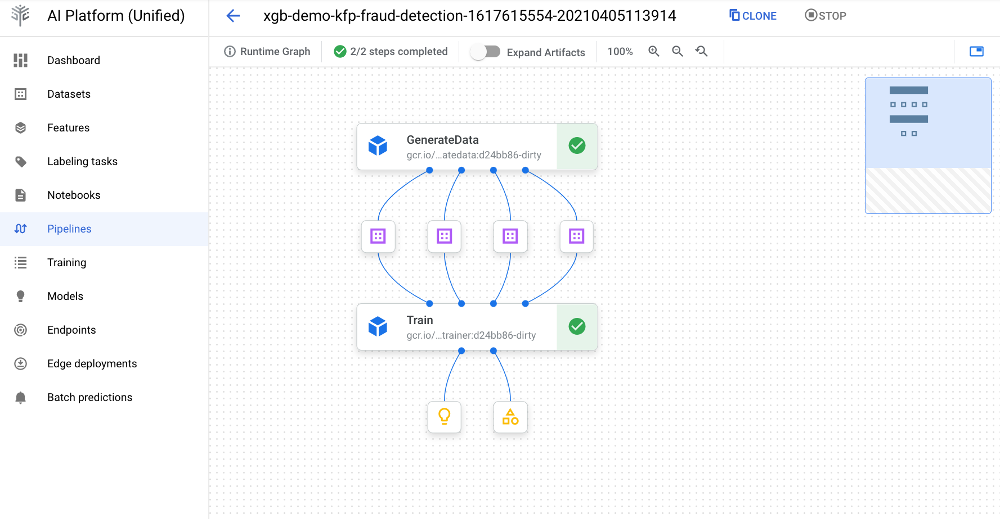
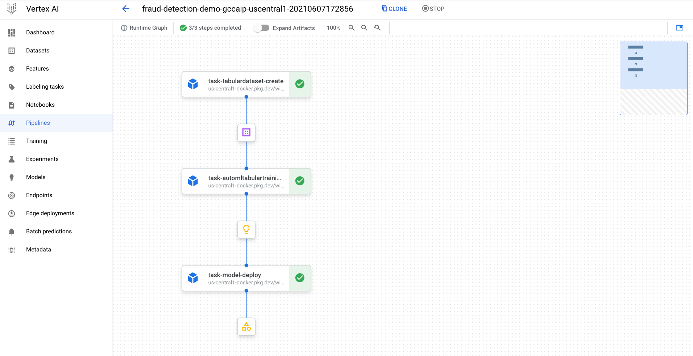
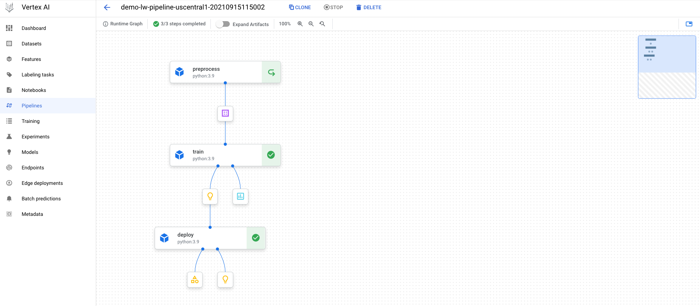
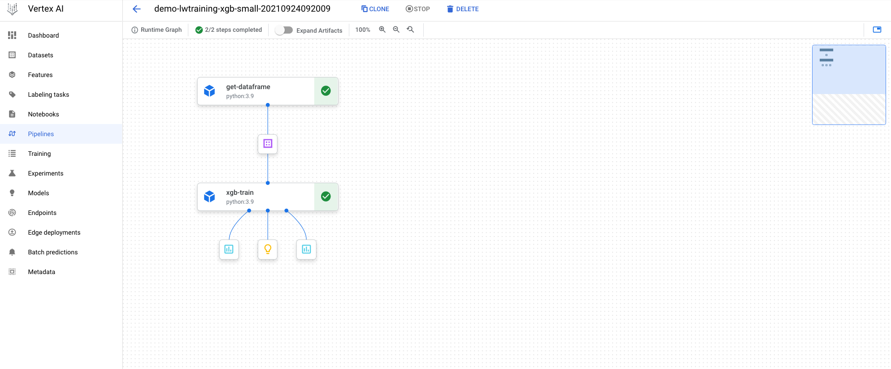
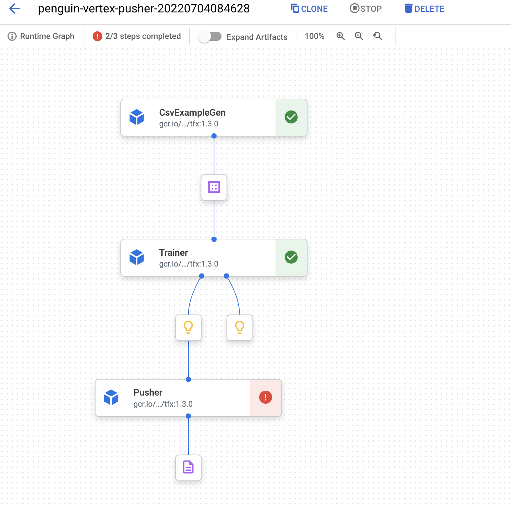
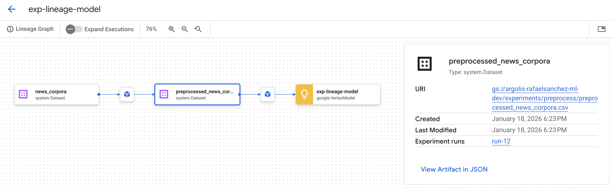
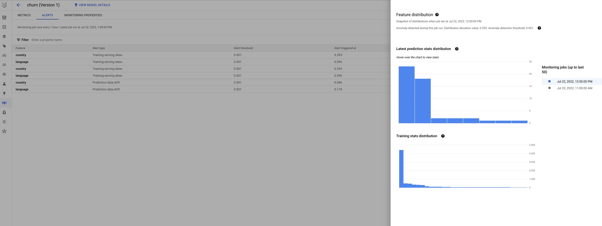
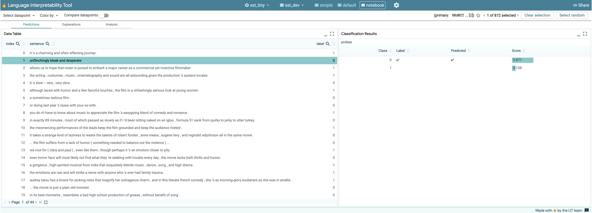
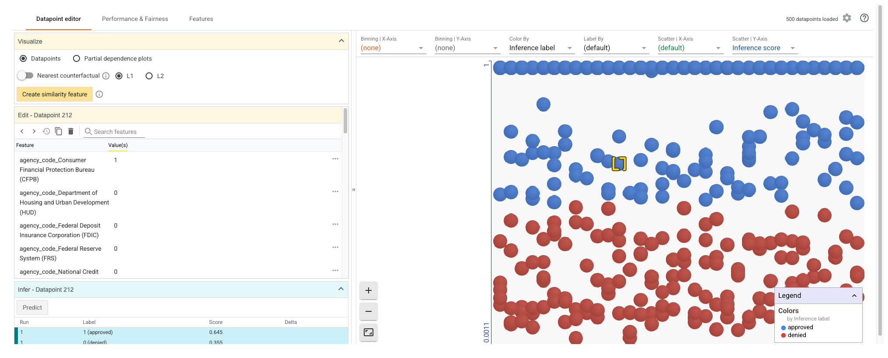
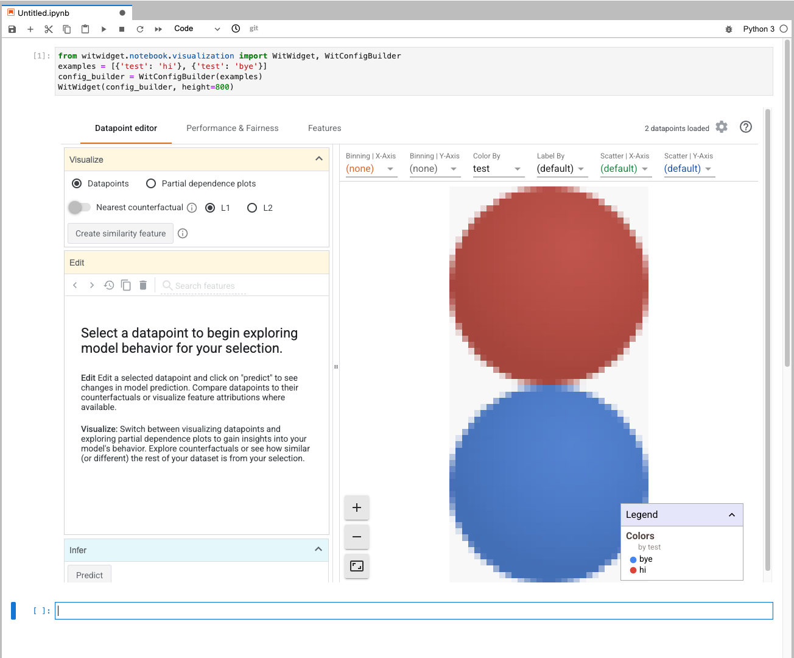

# Vertex AI LABS

This repository contains code samples for **Vertex AI**, including pipelines, metadata and more. Mainly with **finance datasets**.  
Setup and authentication instructions of Vertex SDK are available [here](https://cloud.google.com/vertex-ai/docs/start/client-libraries). Please, complete those before trying any of the labs below.

Sample codes include pipelines, custom training and others. There are three ways to build components in a pipeline:

1. **Docker containers as Components**: most complex. You must write a component `yaml`, that tells the runner how to execute your docker container. You can find a sample in **Lab 1**.

2. **Python scripts as Components**: you must write a Python script and package it in a container.  Then write a component yaml, which tells the system how to execute your component. You can find a sample in **Lab 2**.

3. **Python functions as Component**: easiest way. Use the `@dsl.component` decorator in KFP v2 to package a python function as a component. You can find some samples in **Labs 3 and 4**.


## Lab 01: three-step pipeline with custom containers

This pipeline uses a public dataset at 
[gs://financial_fraud_detection/fraud_data_kaggle.csv](gs://financial_fraud_detection/fraud_data_kaggle.csv) to run a three-step pipeline using custom containers. The Dockerfile definition of each container as well as the code is separated in each directory.

Output of pipeline with custom containers:




## Lab 02: three-step pipeline with GCP operators

This pipeline uses the ULB dataset (tabular detaset, fraud detection) with AutoML, using GCP operators. The three-step pipeline include loading data, training and prediction.

Output of pipeline with GCP components:




## Lab 03: three-step pipeline with lightweight Python components and TensorFlow

Using the ULB dataset, this pipeline trains a Keras model using lightweight python components:

* **Preprocess component:** Load from BigQuery using tensorflow_io
* **Train component:** custom train using a Keras model with 4 layers. 
* **Upload and deploy component:** upload and deploy into an endpoint in Vertex.

To install the proper libraries:



Q: NotImplementedError: unable to open file: libtensorflow_io.so, from paths: ['/usr/local/lib/python3.8/site-packages/tensorflow_io/python/ops/libtensorflow_io.so']
A: TensorFlow and Tensorflow I/O versions must be compatible. Check version compatibility [here](https://github.com/tensorflow/io#tensorflow-version-compatibility) and change the base image and packages accordingly:
```py
@component(
    base_image="gcr.io/deeplearning-platform-release/tf2-cpu.2-6:latest",
    packages_to_install=['tensorflow_io==0.21.0']
)
```


## Lab 04: two-step pipeline with lightweight Python components and XGB

Using two datasets (beans) of different sizes, this code runs two pipelines and makes a pipeline comparison using Vertex AI:

* **[Vertex Pipelines](https://cloud.google.com/vertex-ai/docs/pipelines/introduction)**
* **[Vertex ML Metadata](https://cloud.google.com/vertex-ai/docs/ml-metadata/introduction)**




## Lab 05: Simple TFX pipeline with Vertex training and prediction components

As dataset, we will use same Palmer Penguins dataset. There are four numeric features in this dataset which were already normalized to have range [0,1]. We will build a classification model which predicts the species of penguins. Most code of this example is taken from https://www.tensorflow.org/tfx/tutorials/tfx/penguin_simple.


Setup. You need to upload these two files to GCS:
1. Dataset at `gs://download.tensorflow.org/data/palmer_penguins/penguins_processed.csv` to `DATA_ROOT` folder. You need to make our own copy of the dataset, because TFX ExampleGen reads inputs from a directory.
2. Trainer file `penguin_trainer.py` to `MODULE_ROOT` folder.

Creates a three component penguin pipeline with TFX. You need these frameworks and in these versions:
```
TensorFlow version: 2.6.0
TFX version: 1.3.0
KFP version: 1.8.2
```

Q: Error when calling `from tfx import v1 as tfx`: `AttributeError: module 'tensorflow.tools.docs.doc_controls' has no attribute 'inheritable_header'`   
A: Downgrading `tensorflow-estimators` and `keras` to 2.6 resolved the issue:
```
pip3 install -U tensorflow-estimators==2.6.0
pip3 install -U keras==2.6.0
```




## Lab 06: Cloud Pub/Sub to trigger a pipeline based on Vertex monitoring alerts

Lab 06 uses Cloud Scheduler and Pub/Sub to trigger a Cloud Function, which retrains a pipeline. The pipeline is called only if there are **active alerts** in the Vertex Model Monitoring service.

Setup: 
1. First, you need to train a model for the first time (churn model) running the `retraining.py` pipeline. Note `endpoint` parameter empty. The same retraining pipeline will be launched later from the Cloud Function.
2. Second, you need to create and trigger a monitor alert with `monitor-create.py` and `monitor-trigger.py` (modify the `ENDPOINT_ID` with the model trained from the pipeline). Note that today **Model Monitoring** is only capable to send email notification alerts when any skews are detected. If you want to automatize this, please note also that usually those skews or drifts requires human interaction for troubleshooting or decision making on the retraining. For example, a skew could be caused by a security attack.
3. Finally, create the automatization: create a Cloud Scheduler and a Cloud Function triggered by Pub/Sub. The code for the function is in the `main.py` code provided. Modify the `ENDPOINT` and `MONITORING_JOB` parameters in `config.json`. The cloud function will retrain the pipeline using the pipeline definition file (`retraining-demo-uscentral1.json`) with a new model in 80/20 split configuration **only if there are alerts in the endpoint**.

The retraining process from the cloud function is governed by a config file `config.json` that contains some parameters for the pipeline as well as a boolean variable (default is `true`) to decide if the pipeline will be executed or not, independently of the alert.
As stated before, two files must be uploaded to GCS for the retraining:
1. `retraining-demo-uscentral1.json`: pipeline definition file.
2. `config.json`: configuration file for the Cloud Function. This config file allows to make relevant changes on key parameters without modifying the Cloud Function or the pipeline code.

Cloud Scheduler is configured with frequency `0 9 * * *` (see other sample schedules [here](https://cloud.google.com/scheduler/docs/configuring/cron-job-schedules#sample_schedules)), i.e. one execution every day at 9am that will run the Cloud Function.


FAQ:
* In case you get this error when creating the **Model monitoring job**, add the `bigquery insert` permission to the service account.
```
Error message:
Permission denied for account service-XXXXXXX@gcp-sa-aiplatform.iam.gserviceaccount.com to Insert BigQuery Job.
```
* To get the list of monitoring jobs and their ids:
```sh
gcloud beta ai model-monitoring-jobs list --project=<YOUR_PROJECT_ID>
#######
analysisInstanceSchemaUri: gs://cloud-ai-platform-abc42042-bdf5-4c28-864c-213c408e7d49/instance_schemas/job-245487961133547520/analysis
bigqueryTables:
- bigqueryTablePath: bq://windy-site-254307.model_deployment_monitoring_7369586636331417600.serving_predict
  logSource: SERVING
  logType: PREDICT
createTime: '2021-10-22T13:47:27.752348Z'
displayName: churn
endpoint: projects/655797269815/locations/us-central1/endpoints/7369586636331417600
logTtl: 0s
loggingSamplingStrategy:
  randomSampleConfig:
    sampleRate: 0.8
modelDeploymentMonitoringObjectiveConfigs:
- deployedModelId: '2508443419794210816'
  objectiveConfig:
    predictionDriftDetectionConfig:
      driftThresholds:
        cnt_user_engagement:
          value: 0.5
        country:
          value: 0.001
        language:
          value: 0.001
    trainingDataset:
      bigquerySource:
        inputUri: bq://mco-mm.bqmlga4.train
      targetField: churned
    trainingPredictionSkewDetectionConfig:
      skewThresholds:
        cnt_user_engagement:
          value: 0.5
        country:
          value: 0.001
        language:
          value: 0.001
modelDeploymentMonitoringScheduleConfig:
  monitorInterval: 3600s
modelMonitoringAlertConfig:
  emailAlertConfig:
    userEmails:
    - rafaelsanchez@google.com
name: projects/655797269815/locations/us-central1/modelDeploymentMonitoringJobs/245487961133547520
nextScheduleTime: '2021-10-25T10:00:00Z'
predictInstanceSchemaUri: gs://cloud-ai-platform-abc42042-bdf5-4c28-864c-213c408e7d49/instance_schemas/job-245487961133547520/predict
scheduleState: OFFLINE
state: JOB_STATE_RUNNING
statsAnomaliesBaseDirectory:
  outputUriPrefix: gs://cloud-ai-platform-abc42042-bdf5-4c28-864c-213c408e7d49/model_monitoring/job-245487961133547520
updateTime: '2021-10-25T09:15:55.176995Z'
```


## Lab 07: Feature Store

Creates a **Managed Vertex AI Feature Store**, importing data and perform online and batch serving. The following scripts are provided:

* `fs_create_and_import_fraud.py`: create a Feature Store and perform a batch ingestion of 5000 samples from the [Kaggle fraud detection dataset](gs://financial_fraud_detection/fraud_data_kaggle.csv), stored in GCS.
* `fs_create_and_import_gapic.py`: same as previous one, but using gapic library and enabling monitoring.
* `fs_create_and_import_ulb.py`: creates a Feature Store and perform a batch ingestion of the ULB dataset, stored in BigQuery.
* `fs_delete.py`: removes an existing Feature Store.
* `fs_online_serving.py`: performs online serving over an existing Feature Store.
* `fs_batch_serving.py`: performs batch serving over an existing Feature Store.

Setup:

1. In case of using the Kaggle fraud detection dataset, required for the scripts `fs_create_and_import_fraud.py` and `fs_create_and_import_gapic.py`, you must upload to GCS the following file in **the same region** as the Feature Store: `fraud_data_kaggle_5000.csv`.
2. In case of using the ULB dataset, required for the script `fs_create_and_import_ulb.py`, you must make a copy of the ULB dataset in BigQuery in **the same region** as the Feature Store (refer to constant `BQ_SOURCE`).
3. In case of running the batch serving script (`fs_batch_serving.py`), you must upload to GCS the following file in **the same region** as the Feature Store: `read_entity_instance.csv`:

Feature monitoring in Feature Store:

The script `fs_create_and_import_gapic.py` enables feature monitoring using the gapic client. If you use the new SDK, you can enable the feature moniroting manually from the UI console. If you do not see any monitoring stats after 24 hours, note `TIMESTAMP` field must be included in the dataset (can not be set as a constant) and `Lookback window` is [set by default to 21 days as maximum](https://cloud.google.com/vertex-ai/docs/featurestore/monitoring#set_a_monitoring_configuration).


## Labs 10-11-12: Vertex custom training (ULB dataset) with pre-built containers

These labs create and deploy ML models for the ULB dataset. In all cases it uses a managed Tensorboard to track some metrics:
* **Lab 10:** with CPU. 
* **Lab 11:** with GPU.
* **Lab 12:** with GPU and Hyperparameter tuning.

Setup:
1. Copy the public table `bigquery-public-data.ml_datasets.ulb` into your project and region. Easiest way for this table size is to export as CSV to GCS and then upload it into BigQuery with schema autodetect. Multiregional tables in BigQuery or GCS works with regional training in Vertex AI training. For example: you can run a Vertex AI training job in `europe-west4` using a EU multiregional dataset from a BigQuery.
2. Create a tensorboard instance with `gcloud ai tensorboards create --display-name DISPLAY_NAME --project PROJECT_NAME`, and modify the `TENSORBOARD_RESOURCE` env variable accordingly. Example:
```sh
gcloud beta ai tensorboards create --display-name ml-in-the-cloud-rafaelsanchez --project argolis-rafaelsanchez-ml-dev
Created Vertex AI Tensorboard: projects/989788194604/locations/europe-west4/tensorboards/3449511023961178112
```
3. Create a service account for the Tensorboard service. It must have the Storage Admin role (`roles/storage.admin`) and Vertex AI User role (`roles/aiplatform.user`) associated with the Tensorboard service.

> If you use Vertex AI Workbench, note there are actually **two service accounts**: the **compute engine service account**, which executes the full pipeline, and needs the  Service Account User and Vertex AI User roles; and the **service account specific for the training step** that requires Service Account User role, Storage Admin role, Vertex AI User role, BQ Read Session Userrole (`bigquery.readsessions.create`) and BigQuery Data Editor. All of them are required since thet training step must read from the dataset (and BigQuery) and must write in GCS for the Tensorboard service.

Run:
```sh
python3 10-training-tables-ulb/custom_training_simple.py
python3 11-training-tables-ulb-gpu/custom_training_simple_gpu.py
python3 12-training-tables-ulb-ht/custom_training_simple_ht.py
```

Notes:
* TensorFlow and Tensorflow I/O versions must be compatible in your environment. This is guaranteed if you use Vertex AI Workbench. Check version compatibility [here](https://github.com/tensorflow/io#tensorflow-version-compatibility).


## Lab 13: Vertex distributed custom training (Iris dataset and Dask) with custom containers

Vertex distriuted custom training job over 2xCPU, using XGBoost **custom containers** (for training), the [Dask framework](https://xgboost.readthedocs.io/en/latest/tutorials/dask.html) and the [tabular iris dataset](https://archive.ics.uci.edu/ml/datasets/iris). This lab uses two CPUs.

Setup:
1. The dataset is downloaded from a bucket in Google Cloud `gs://cloud-samples-data/ai-platform/iris/iris_data.csv`. Alternatively, you can copy the public table `bigquery-public-data.ml_datasets.iris` into your project and region. Easiest way for this table size is to export as CSV to GCS and then upload it into BigQuery with schema autodetect.
2. Create the repository and submit the custom container to **Artifact Registry**:
```sh
gcloud artifacts repositories create ml-pipelines-repo --repository-format=docker --location=europe-west4 --description="ML pipelines repository"
gcloud auth configure-docker europe-west4-docker.pkg.dev
gcloud builds submit --tag europe-west4-docker.pkg.dev/argolis-rafaelsanchez-ml-dev/ml-pipelines-repo/europe-west4-docker.pkg.dev/argolis-rafaelsanchez-ml-dev/ml-pipelines-repo/13-training-tables-xgboost-noprebuilt
```

Instructions:
```sh
python3 13-training-tables-iris/custom_training.py
```

For more information about custom training in Vertex, visit the [official documentation](https://cloud.google.com/vertex-ai/docs/training/custom-training) and [this github repo](https://github.com/rafaelsf80/vertex-custom-training)


## Lab 14: Experiments and metrics visualization

Vertex AI provides tools for experiment tracking and metrics visualization:

1. **Vertex AI experiments**: logs different parameters.

2. **Lineage tracking**: shows tracking of a model with the raw dataset and the preprocessed dataset.

3. **Cloud profiler**: implements a cloud profiler on Tensorboard to measure CPU/GPU metrics and others. Make sure the ervice account must have the following permissions: Storage Admin (to write logs to GCS); Vertex AI User; Cloud Profiler Agent (otherwise tensorboard will be empty)




## Lab 15: TabNet with Tabular workflows

This lab creates a classsification model based on [TabNet](https://arxiv.org/abs/1908.07442), using the ULB finantial dataset, and Vertex AI Tabular Workflows. 

[TabNet](https://arxiv.org/abs/1908.07442) uses [sequential attention](https://proceedings.neurips.cc/paper/2017/file/3f5ee243547dee91fbd053c1c4a845aa-Paper.pdf) to choose which features to reason from at each decision step. This promotes interpretability and more efficient learning because the learning capacity is used for the most salient features.

> You will need the latest Vertex SDK and pipeline component version for TabNet: `pip3 install --upgrade google-cloud-aiplatform google-cloud-pipeline-components --user -q`

Configurable hyperparameters in this example are the following (note TabNet allows a hyperparameter tuning option to look for the best hyperparameters for your data):

|Hyperparameter|
|---|
|max_steps|
|max_train_secs|
|learning_rate|


## Lab 20: Simple online and batch prediction

Simple prediction on the model deployed in Lab 3 and 10-11-12 (fraud detection model). 
For both online and batch, make sure you modify the `endpoint_id` and `model_id` in the source code accordingly.

* **Online predict:** Input format (note can actually be multiple inputs):
```python
response = endpoint.predict([{'Time': 80422,'Amount': 17.99,'V1': -0.24,'V2': -0.027,'V3': 0.064,'V4': -0.16,'V5': -0.152,'V6': -0.3,'V7': -0.03,'V8': -0.01,'V9': -0.13,'V10': -0.13 ,'V11': -0.16,'V12': 0.06,'V13': -0.11,'V14': 2.1,'V15': -0.07,'V16': -0.033,'V17': -0.14,'V18': -0.08,'V19': -0.062,'V20': -0.08,'V21': -0.06,'V22': -0.088,'V23': -0.03,'V24': -0,15, 'V25': -0.04,'V26': -0.99,'V27': -0.13,'V28': 0.003}])
Prediction(predictions=[[1.88683789e-05]], deployed_model_id='7739198465124597760', explanations=None)
```

* **Batch predict:** Input format, with multiple inputs as shown by `saved_model_cli`, content of file [batch_ulb_gcs_5.jsonl](batch_ulb_gcs_5.jsonl), that must be uploaded to GCS before launching the batch prediction job:
```json
{"Time": 80422, "Amount": 17.99, "V1": -0.24, "V2": -0.027, "V3": 0.064, "V4": -0.16, "V5": -0.152, "V6": -0.3, "V7": -0.03, "V8": -0.01, "V9": -0.13, "V10": -0.18, "V11": -0.16, "V12": 0.06, "V13": -0.11, "V14": 2.1, "V15": -0.07, "V16": -0.033, "V17": -0.14, "V18": -0.08, "V19": -0.062, "V20": -0.08, "V21": -0.06, "V22": -0.088, "V23": -0.03, "V24": 0.01, "V25": -0.04, "V26": -0.99, "V27": -0.13, "V28": 0.003}
{"Time": 80522, "Amount": 18.99, "V1": -0.24, "V2": -0.027, "V3": 0.064, "V4": -0.16, "V5": -0.152, "V6": -0.3, "V7": -0.03, "V8": -0.01, "V9": -0.13, "V10": -0.18, "V11": -0.16, "V12": 0.06, "V13": -0.11, "V14": 2.1, "V15": -0.07, "V16": -0.033, "V17": -0.14, "V18": -0.08, "V19": -0.062, "V20": -0.08, "V21": -0.06, "V22": -0.088, "V23": -0.03, "V24": 0.01, "V25": -0.04, "V26": -0.99, "V27": -0.13, "V28": 0.003}
{"Time": 80622, "Amount": 19.99, "V1": -0.24, "V2": -0.027, "V3": 0.064, "V4": -0.16, "V5": -0.152, "V6": -0.3, "V7": -0.03, "V8": -0.01, "V9": -0.13, "V10": -0.18, "V11": -0.16, "V12": 0.06, "V13": -0.11, "V14": 2.1, "V15": -0.07, "V16": -0.033, "V17": -0.14, "V18": -0.08, "V19": -0.062, "V20": -0.08, "V21": -0.06, "V22": -0.088, "V23": -0.03, "V24": 0.01, "V25": -0.04, "V26": -0.99, "V27": -0.13, "V28": 0.003}
```


This is `saved_model_cli` output:
```sh
saved_model_cli show --dir rafa --tag_set serve --signature_def serving_default

The given SavedModel SignatureDef contains the following input(s):
  inputs['Amount'] tensor_info:
      dtype: DT_FLOAT
      shape: (-1, 1)
      name: serving_default_Amount:0
  inputs['Time'] tensor_info:
      dtype: DT_FLOAT
      shape: (-1, 1)
      name: serving_default_Time:0
  inputs['V1'] tensor_info:
      dtype: DT_FLOAT
      shape: (-1, 1)
      name: serving_default_V1:0
  inputs['V10'] tensor_info:
      dtype: DT_FLOAT
      shape: (-1, 1)
      name: serving_default_V10:0
  inputs['V11'] tensor_info:
      dtype: DT_FLOAT
      shape: (-1, 1)
      name: serving_default_V11:0
  inputs['V12'] tensor_info:
      dtype: DT_FLOAT
      shape: (-1, 1)
      name: serving_default_V12:0
  inputs['V13'] tensor_info:
      dtype: DT_FLOAT
      shape: (-1, 1)
      name: serving_default_V13:0
  inputs['V14'] tensor_info:
      dtype: DT_FLOAT
      shape: (-1, 1)
      name: serving_default_V14:0
  inputs['V15'] tensor_info:
      dtype: DT_FLOAT
      shape: (-1, 1)
      name: serving_default_V15:0
  inputs['V16'] tensor_info:
      dtype: DT_FLOAT
      shape: (-1, 1)
      name: serving_default_V16:0
  inputs['V17'] tensor_info:
      dtype: DT_FLOAT
      shape: (-1, 1)
      name: serving_default_V17:0
  inputs['V18'] tensor_info:
      dtype: DT_FLOAT
      shape: (-1, 1)
      name: serving_default_V18:0
  inputs['V19'] tensor_info:
      dtype: DT_FLOAT
      shape: (-1, 1)
      name: serving_default_V19:0
  inputs['V2'] tensor_info:
      dtype: DT_FLOAT
      shape: (-1, 1)
      name: serving_default_V2:0
  inputs['V20'] tensor_info:
      dtype: DT_FLOAT
      shape: (-1, 1)
      name: serving_default_V20:0
  inputs['V21'] tensor_info:
      dtype: DT_FLOAT
      shape: (-1, 1)
      name: serving_default_V21:0
  inputs['V22'] tensor_info:
      dtype: DT_FLOAT
      shape: (-1, 1)
      name: serving_default_V22:0
  inputs['V23'] tensor_info:
      dtype: DT_FLOAT
      shape: (-1, 1)
      name: serving_default_V23:0
  inputs['V24'] tensor_info:
      dtype: DT_FLOAT
      shape: (-1, 1)
      name: serving_default_V24:0
  inputs['V25'] tensor_info:
      dtype: DT_FLOAT
      shape: (-1, 1)
      name: serving_default_V25:0
  inputs['V26'] tensor_info:
      dtype: DT_FLOAT
      shape: (-1, 1)
      name: serving_default_V26:0
  inputs['V27'] tensor_info:
      dtype: DT_FLOAT
      shape: (-1, 1)
      name: serving_default_V27:0
  inputs['V28'] tensor_info:
      dtype: DT_FLOAT
      shape: (-1, 1)
      name: serving_default_V28:0
  inputs['V3'] tensor_info:
      dtype: DT_FLOAT
      shape: (-1, 1)
      name: serving_default_V3:0
  inputs['V4'] tensor_info:
      dtype: DT_FLOAT
      shape: (-1, 1)
      name: serving_default_V4:0
  inputs['V5'] tensor_info:
      dtype: DT_FLOAT
      shape: (-1, 1)
      name: serving_default_V5:0
  inputs['V6'] tensor_info:
      dtype: DT_FLOAT
      shape: (-1, 1)
      name: serving_default_V6:0
  inputs['V7'] tensor_info:
      dtype: DT_FLOAT
      shape: (-1, 1)
      name: serving_default_V7:0
  inputs['V8'] tensor_info:
      dtype: DT_FLOAT
      shape: (-1, 1)
      name: serving_default_V8:0
  inputs['V9'] tensor_info:
      dtype: DT_FLOAT
      shape: (-1, 1)
      name: serving_default_V9:0
The given SavedModel SignatureDef contains the following output(s):
  outputs['dense_1'] tensor_info:
      dtype: DT_FLOAT
      shape: (-1, 1)
      name: StatefulPartitionedCall:0
Method name is: tensorflow/serving/predict
```


Output of batch prediction in GCS. Note results **may not be in order** and splitted in multiple files (pattern `prediction.results-000XX-of-000TT`, depending on the number of workers used:
```json
{"instance": {"Time": 80422, "Amount": 17.99, "V1": -0.24, "V2": -0.027, "V3": 0.064, "V4": -0.16, "V5": -0.152, "V6": -0.3, "V7": -0.03, "V8": -0.01, "V9": -0.13, "V10": -0.18, "V11": -0.16, "V12": 0.06, "V13": -0.11, "V14": 2.1, "V15": -0.07, "V16": -0.033, "V17": -0.14, "V18": -0.08, "V19": -0.062, "V20": -0.08, "V21": -0.06, "V22": -0.088, "V23": -0.03, "V24": 0.01, "V25": -0.04, "V26": -0.99, "V27": -0.13, "V28": 0.003}, "prediction": [1.0]}
{"instance": {"Time": 80422, "Amount": 17.99, "V1": -0.24, "V2": -0.027, "V3": 0.064, "V4": -0.16, "V5": -0.152, "V6": -0.3, "V7": -0.03, "V8": -0.01, "V9": -0.13, "V10": -0.18, "V11": -0.16, "V12": 0.06, "V13": -0.11, "V14": 2.1, "V15": -0.07, "V16": -0.033, "V17": -0.14, "V18": -0.08, "V19": -0.062, "V20": -0.08, "V21": -0.06, "V22": -0.088, "V23": -0.03, "V24": 0.01, "V25": -0.04, "V26": -0.99, "V27": -0.13, "V28": 0.003}, "prediction": [1.0]}
{"instance": {"Time": 80422, "Amount": 17.99, "V1": -0.24, "V2": -0.027, "V3": 0.064, "V4": -0.16, "V5": -0.152, "V6": -0.3, "V7": -0.03, "V8": -0.01, "V9": -0.13, "V10": -0.18, "V11": -0.16, "V12": 0.06, "V13": -0.11, "V14": 2.1, "V15": -0.07, "V16": -0.033, "V17": -0.14, "V18": -0.08, "V19": -0.062, "V20": -0.08, "V21": -0.06, "V22": -0.088, "V23": -0.03, "V24": 0.01, "V25": -0.04, "V26": -0.99, "V27": -0.13, "V28": 0.003}, "prediction": [1.0]}
```


## Lab 21: Vertex Explainable AI with Boston housing dataset (tabular)

This lab uses the public **Boston housing dataset** to demo Vertex Explainable AI on **an XGB model**. Boston housing model is a **classification model**, that will be trained and deployed in a Vertex endpoint. For explainability, just call `model.explain` from Vertex SDK.

Results of explainability should look like this:
```bash
python3 explanations/explanations.py
Feature name      Feature value    Attribution value
--------------  ---------------  -------------------
crim                 0.0271541           0.0391987
zn                   0                   0
indus                0.0271772          -0.0757082
chas                 0                   0
nox                  0.00101952          0.00101509
rm                   0.00966066          0.000826073
age                  0.15015            -0.0678396
dis                  0.0027548          -0.00833483
rad                  0.036036            0.00797768
tax                  1                  -0.602567
ptratio              0.0303303          -0.0703282
b                    0.0409159           0.0313404
lstat                0.0436186          -0.252064
```

In case you would like to test a finantial dataset, [this codelab](https://codelabs.developers.google.com/vertex-automl-tabular) shows a model **trained with AutoML** (not a custom model) and deployed in a Vertex Endpoint.

Feature importance and confussion matrix are available in the **Evaluate section** of the Vertex AI console. Note that if features werr normalized, explainability results may not be very significtive.


## Lab 22: Model monitor with Games dataset (tabular)

This lab contains the same code [as this blog post](https://cloud.google.com/blog/topics/developers-practitioners/monitor-models-training-serving-skew-vertex-ai), which describes a Churn prediction model for game developers using Google Analytics 4 (GA4) and BigQuery ML coming from [this blog article by Minhaz Kazi and Polong Lin](https://cloud.google.com/blog/topics/developers-practitioners/churn-prediction-game-developers-using-google-analytics-4-ga4-and-bigquery-ml).

**Vertex Model monitoring** provides the following capabilities:

* For **online prediction**: (a) skew detection and (b) drift detection. (a) compares the training data with incoming prediction data. (b) looks for changes in the incoming prediction data over time, i.e., Where **train/serve skew** is comparing serving feature distributions with training feature distributions, **drift** is comparing serving feature distributions at time `t-1` with serving feature distributions at time `t`.  
* For **batch prediction**: (a) skew detection -- i.e. compare batch prediction feature inputs with the feature values used during training.

In both cases, model monitoring has a **minimum frequency of 1 hour**, which means if we want to trigger alerts or see some monitoring results from our (batch) predictions, you need  to wait >1h to see results.

Python scripts needed to run a monitoring job and trigger alerts (run in this order)
1. `import-deploy.py`: import and deploy a model that will be used for Model Monitoring.
2. `monitor-create.py`: creates Model monitoring job. Note the input BigQuery table `DATASET_BQ_URI` must be in the same region. Otherwise, you need to create a copy of `bq://mco-mm.bqmlga4.train` in your region.
3. `monitor-trigger.py`: trigger alerts in the Model monitoring job (it may take up to 1 hour).




## Lab 23: LIT with Kaggle happyDB dataset (NLP)

This lab shows the [Kaggle happyDB dataset](https://www.kaggle.com/ritresearch/happydb). You can see how to create an AutoML NLP model in [this tutorial](https://cloud.google.com/natural-language/automl/docs/quickstart). The simplified dataset used in this lab is publicly available at GCS at `gs://cloud-ml-data/NL-classification/happiness.csv` and contains 7 labels (affection, bonding, achievement, nature, exercise, enjoy_the_moment, leisure)

Steps:
1. Check the happyDB dataset at [Kaggle page](https://www.kaggle.com/ritresearch/happydb), and show the AutoML NLP tutorial main page.
2. Import the dataset in Vertex AI and train an AutoML text classification model. This will take time.
3. Show a prediction from the UI console.
4. Install LIT widget with `pip3 install lit_nlp` 
5. After that, use LIT to show explainability by launching `predict_lit.py` within a Vertex Workbench. This is a multiclass classification model (NLP) for the happyness dataset. use the following test data:
```csv
text,label,docID
I ran 4 kilometers at the park.,4,22588212
I planted to build a garden in my house.,3,19151312
I went bouldering at a gym with a good friend.,4,10827612
I was invited to a party,0,12590009
It was a nive workout in the gym.,4,10876238
Went to make some yoga,4,15105423
I learned that my friend was finally getting a liver transplant after 14 years.,0,19734891
I tried real filette for the first time,5,21668996
feeling the warmth of the sun as i walked outside with my cat,0,21577203
testing,1,21577203
testin2,2,21577203
```

Alternatively, you can also test LIT within a Vertex Workbench with some data downloaded from GCS:
```py
# Install LIT and transformers packages. The transformers package is needed by the model and dataset we are using.
# Replace tensorflow-datasets with the nightly package to get up-to-date dataset paths.
!pip uninstall -y tensorflow-datasets
!pip install lit_nlp tfds-nightly transformers==4.1.1

# Fetch the trained model weights
!wget https://storage.googleapis.com/what-if-tool-resources/lit-models/sst2_tiny.tar.gz
!tar -xvf sst2_tiny.tar.gz

# Create the LIT widget with the model and dataset to analyze.
from lit_nlp import notebook
from lit_nlp.examples.datasets import glue
from lit_nlp.examples.models import glue_models

datasets = {'sst_dev': glue.SST2Data('validation')}
models = {'sst_tiny': glue_models.SST2Model('./')}

widget = notebook.LitWidget(models, datasets, height=800)

# Render the widget
widget.render()
```




## Lab 24: BQML and explainability

Dataset query:
```sql
#standardSQL
SELECT
  EXTRACT(DATE from start_date) AS date,
  COUNT(*) AS num_trips
FROM
 `bigquery-public-data.london_bicycles.cycle_hire`
GROUP BY date
LIMIT 1000
```

Model training:
```sql
#standardSQL
CREATE OR REPLACE MODEL auv_london_bike_bqml.trips_arima_model
OPTIONS
 (model_type = 'ARIMA_PLUS',
  time_series_timestamp_col = 'date',
  time_series_data_col = 'num_trips',
  decompose_time_series = TRUE
 ) AS
SELECT
  EXTRACT(DATE from start_date) AS date,
  COUNT(*) AS num_trips
FROM
 `bigquery-public-data.london_bicycles.cycle_hire`
GROUP BY date
```

Explanations:
```sql
#standardSQL
SELECT
 *
FROM
 ML.EXPLAIN_FORECAST(MODEL auv_london_bike_bqml.trips_arima_model,
                     STRUCT(365 AS horizon, 0.9 AS confidence_level))
```


## Archived: WIT with a mortgages dataset (tabular)

This lab uses a [mortgage dataset from ffiec.gov](https://www.ffiec.gov/hmda/hmdaflat.htm) to train an XGBoost model. Data owner is the [Federal Financial Institutions Examination Council](https://www.ffiec.gov/default.htm). There is a blog post from Sara Robinson, very similar to what's done in this lab, [here](https://sararobinson.dev/2019/08/01/explaining-financial-ml-models.html).

This is a binary classification model built **with XGBoost and trained on the mortgage dataset**. It predicts whether or not a mortgage application will be approved. The codelab is [here](https://codelabs.developers.google.com/vertex-xgb-wit), and a simpler notebook with a deployed XGBoost model can be found [here](https://cloud.google.com/ai-platform/prediction/docs/using-what-if-tool).

Steps:
1. Install xgboost with `pip3 install xgboost==1.2.0` 
1. Download the dataset with `gsutil cp gs://mortgage_dataset_files/mortgage-small.csv .`.
2. Run `train_and_wit.py` within Vertex Workbench.

Exploration ideas:
* **Individual data points**: the default graph shows all data points from the test set, colored by their ground truth label (approved or denied)
  * Try selecting data points close to the middle and tweaking some of their feature values. Then run inference again to see if the model prediction changes
  * Select a data point and then move the "Show nearest counterfactual datapoint" slider to the right. This will highlight a data point with feature values closest to your original one, but with a different prediction
  
* **Binning data**: create separate graphs for individual features
  * From the "Binning - X axis" dropdown, try selecting one of the agency codes, for example "Department of Housing and Urban Development (HUD)". This will create 2 separate graphs, one for loan applications from the HUD (graph labeled 1), and one for all other agencies (graph labeled 0). This shows us that loans from this agency are more likely to be denied

* **Exploring overall performance**: Click on the "Performance & Fairness" tab to view overall performance statistics on the model's results on the provided dataset, including confusion matrices, PR curves, and ROC curves.
   * Experiment with the threshold slider, raising and lowering the positive classification score the model needs to return before it decides to predict "approved" for the loan, and see how it changes accuracy, false positives, and false negatives.
   * On the left side "Slice by" menu, select "loan_purpose_Home purchase". You'll now see performance on the two subsets of your data: the "0" slice shows when the loan is not for a home purchase, and the "1" slice is for when the loan is for a home purchase. Notice that the model's false positive rate is much higher on loans for home purchases. If you expand the rows to look at the confusion matrices, you can see that the model predicts "approved" more often for home purchase loans.
   * You can use the optimization buttons on the left side to have the tool auto-select different positive classification thresholds for each slice in order to achieve different goals. If you select the "Demographic parity" button, then the two thresholds will be adjusted so that the model predicts "approved" for a similar percentage of applicants in both slices. What does this do to the accuracy, false positives and false negatives for each slice?




Another basic example with the `WitWidget` is the following (must be rendered in a notebook):
```py
# Run this within Vertex Workbench (managed notebook)
from witwidget.notebook.visualization import WitWidget, WitConfigBuilder
examples = [{'test': 'hi'}, {'test': 'bye'}]
config_builder = WitConfigBuilder(examples)
WitWidget(config_builder, height=800)
```



## References

`[1]` Notebook samples about Vertex AI (part 1): https://github.com/GoogleCloudPlatform/vertex-ai-samples/tree/master/notebooks  
`[2]` Notebooks samples about Vertex AI (part 2): https://github.com/GoogleCloudPlatform/cloudml-samples/tree/master/notebooks  
`[3]` Codelab Intro to Vertex Pipelines: https://codelabs.developers.google.com/vertex-pipelines-intro  
`[4]` Codelab Vertex pipelines and metadata: https://codelabs.developers.google.com/vertex-mlmd-pipelines  
`[5]` Practitioners guide to MLOps: https://cloud.google.com/resources/mlops-whitepaper  
`[6]` Feature attributions in model monitoring: https://cloud.google.com/blog/topics/developers-practitioners/monitoring-feature-attributions-how-google-saved-one-largest-ml-services-trouble   


## References XAI and Monitoring

`[1]` Notebook sample about Model monitoring: https://github.com/GoogleCloudPlatform/vertex-ai-samples/tree/master/notebooks/official/model_monitoring   
`[2]` Notebook sample about Explainable AI: https://github.com/GoogleCloudPlatform/vertex-ai-samples/tree/master/notebooks/official/explainable_ai     
`[3]` Google Cloud blog post: [Monitor models for training-serving skew with Vertex AI](https://cloud.google.com/blog/topics/developers-practitioners/monitor-models-training-serving-skew-vertex-ai)    
`[4]` Google Cloud blog post: [Why you need to explain machine learning models](https://cloud.google.com/blog/products/ai-machine-learning/why-you-need-to-explain-machine-learning-models)    
`[5]` Responsible AI practices: https://ai.google/responsibilities/responsible-ai-practices/    
`[6]` Explainable AI whitepaper: https://storage.googleapis.com/cloud-ai-whitepapers/AI%20Explainability%20Whitepaper.pdf    
`[7]` What-if Tool (WIT): https://pair-code.github.io/what-if-tool/   
`[8]` Language Interpretability Tool (LIT): https://pair-code.github.io/lit/    
`[9]` Google Cloud blog post: [Explaining machine learning models to business users using BigQueryML and Looker](https://cloud.google.com/blog/products/data-analytics/explainable-ai-using-bigquery-machine-learning-and-looker)        
